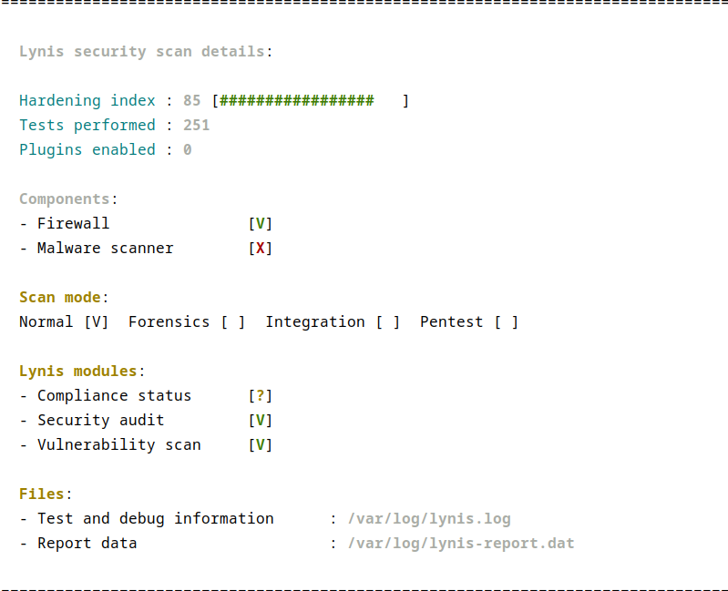

# Rahbia Live Coding
### Organized by DockerMe group
  - **Speaker:** [Ahmad Rafiee](https://www.linkedin.com/in/ahmad-rafiee)
  - **Date:** 13 November 2024
  - **Number of Sessions:** 02 (Session 02)

### Video Link:

## Session 02:
  - **Operating System Hardening**
  - **SSH Hardening**

### What We Did
In this session, we covered essential practices for hardening both the operating system and SSH configurations to enhance security.

**Ansible Code Structuring**
Organized our Ansible playbooks and roles for streamlined configuration management. Established a clear structure to facilitate scalability and reusability of automation code.

**Operating System Hardening**
Key steps for securing the OS, including system updates, disabling unnecessary services, and securing system configurations.

**SSH Hardening**
Configurations to strengthen SSH security, such as limiting access, enforcing strong authentication, and other best practices.

**Troubleshooting Cases**
Real-time troubleshooting of issues encountered during system and SSH hardening.
Discussion on diagnosing common security configuration issues and effective resolution strategies.

## Session Outputs:
**Hardening result:**

## Reference:
  - [Hardening Projects](https://github.com/dev-sec/ansible-collection-hardening/)

## 🔗 Links

