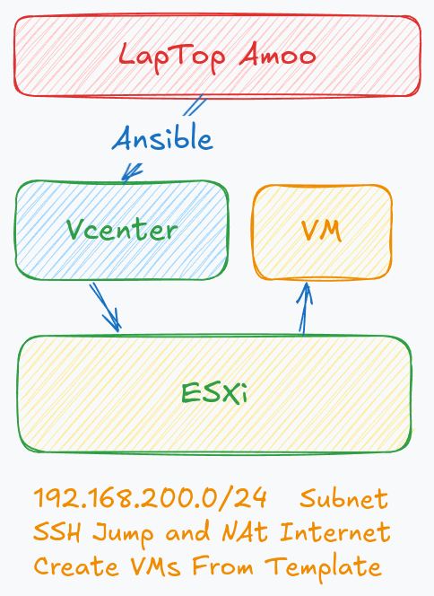

Managing Virtual Machines with Ansible on vCenter
=========

This Ansible role provides a simple and efficient way to manage Virtual Machines (VMs) on vCenter. By automating tasks such as VM creation, configuration, and lifecycle management, this role is designed to streamline DevOps processes and reduce manual effort.



Features
------------

This role includes the following capabilities:

- Create new VMs from existing templates.
- Configure VM resources such as CPU, memory, and disk size.
- Attach VMs to specified networks.
- Manage existing VMs within a vCenter environment.

Requirements
------------

Ensure the following prerequisites are met before using this role:

1. **Access to vCenter**:
   - A vCenter server with appropriate permissions for managing VMs (e.g., Administrator or a custom role with sufficient rights).

2. **Python Libraries**:
   - Install the `pyvmomi` library for communication with the vCenter server:
     ```bash
     pip install pyvmomi
     ```

3. **VMware Modules**:
   - This role uses VMware modules from the `community.vmware` collection. Install it using:
     ```bash
     ansible-galaxy collection install community.vmware
     ```

4. **vCenter Connection Configuration**:
   - Define vCenter connection details such as hostname, username, password, and validation settings in the inventory or variables file.

Role Variables
--------------

All variables used in this role are located in the default directory of the role. You can find and modify them in the `roles/vms_management/defaults/main.yml`

These variables can be defined in:
  - `group_vars/` or `host_vars/` files.
  - `default/main.yml` file.
  - Directly in the inventory.
  - Directly in the playbook.
  - Passed as extra variables during execution.

Dependencies
------------

This role does not rely on other Ansible Galaxy roles. However, it uses the `community.vmware` collection, which should be installed as described in the Requirements section.

Example Playbook
----------------

Here's an example playbook that demonstrates how to use this role to create a VM on vCenter:

```yaml
- name: VMs Management
  hosts: all
  become: true
  gather_facts: false
  roles:
    - ../roles/vms_management
```

Author Information
------------------
This role is maintained by **Ahmad Rafiee**. For questions or contributions, feel free to reach out:

**Email:** Rafiee1001@gmail.com
**Website:** DockerMe.ir

